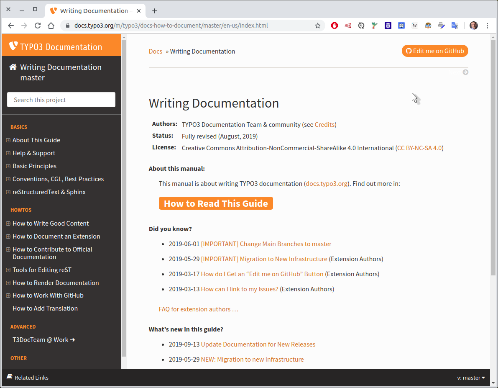
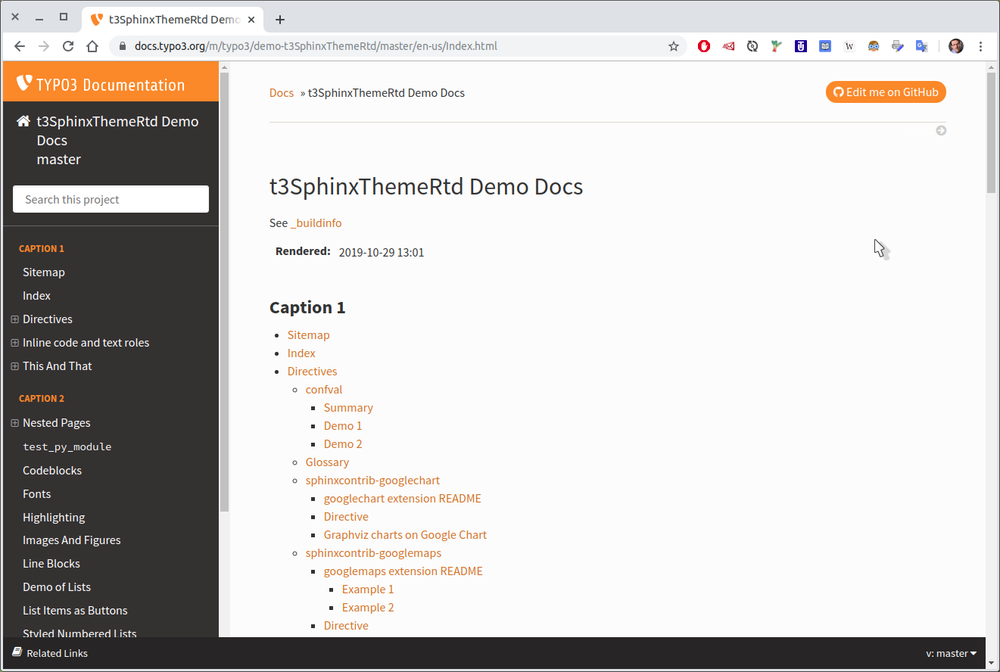
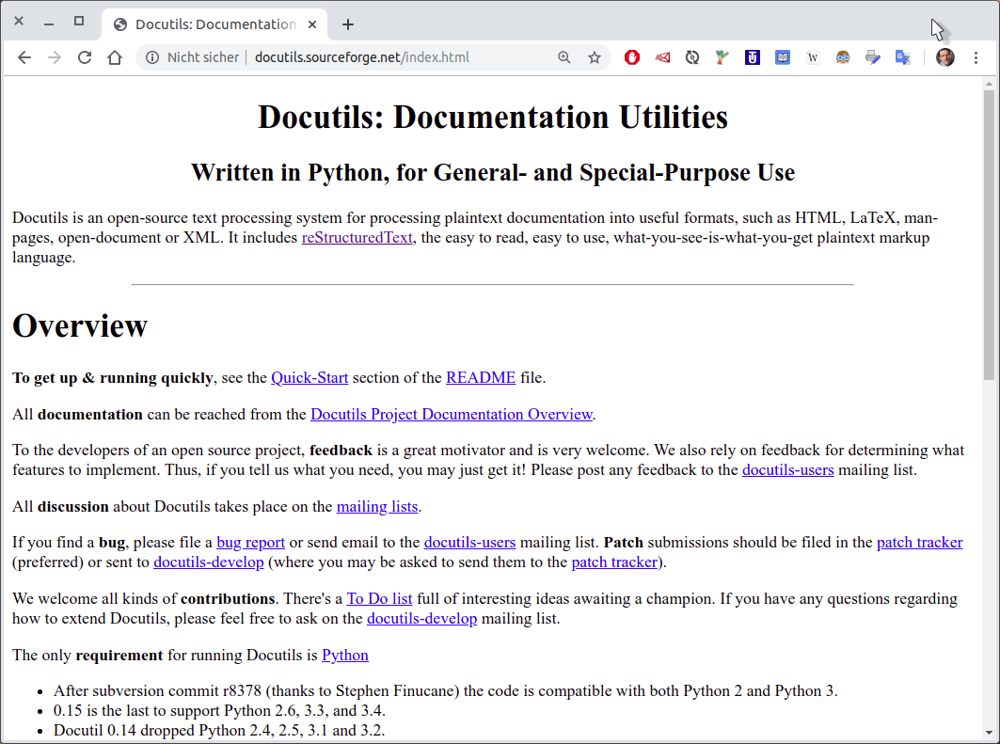

.. include:: /Includes.rst.txt

===========================
What reST can I use?
===========================

.

.

The official guide
==================

`Writing Documentation
<https://docs.typo3.org/m/typo3/docs-how-to-document/master/en-us/>`__

.

.

.

.

.

.

.

.

.

.

The "stress test" for our theme
===============================

The `t3SphinxThemeRtdDemoDocs
<https://docs.typo3.org/m/typo3/demo-t3SphinxThemeRtd/master/en-us/>`__

.

.

.

.

.

.

.

.

.

.

.

.

.

.

.

.

.

.

What sphinx-doc.org tells you
=============================

`sphinx-doc.org
<http://www.sphinx-doc.org/en/master/>`__

Q: Can I use everything shown on sphinx-doc.org?
   A: No, give it a try and see if it works.

.

.

.

.

.

.

.

.

.

.

.

.

.

.

.

.

.

.

What Docutils tells you
=======================

This is the most basic level of reST definitions.

Difficult to read, looking ugly, but still most authoritative.

See the following page.

.

.

.

.

.

.

.

.

.

.

.

.

.

.

.

.

.

