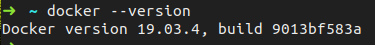
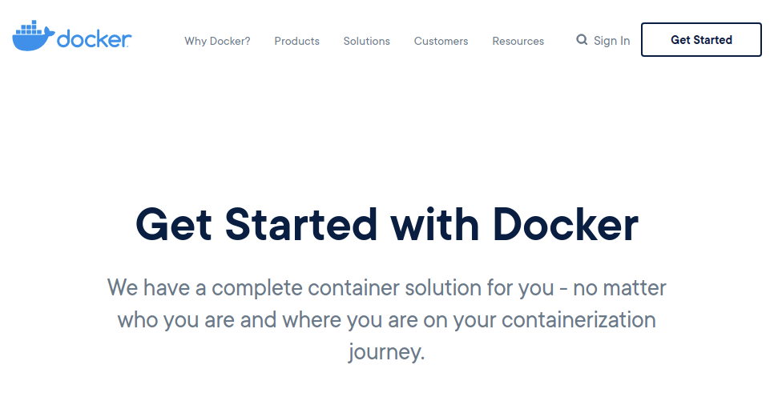

.. include:: /Includes.rst.txt

=======================
Get Docker Client
=======================

.

.

Do I have Docker client installed already?
==================================

::

   docker --version

   #

.

.

.

.

.

.

.

.

.

.

.

.

.

.

.

.

.

.

.

Get Docker
==========

`Get Started with Docker
<https://www.docker.com/get-started>`__

.

.

.

.

.

.

.

.

.

.

.

.

.

.

.

.

