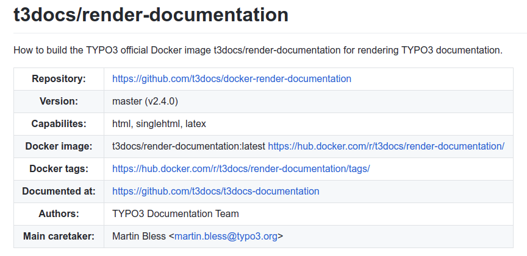
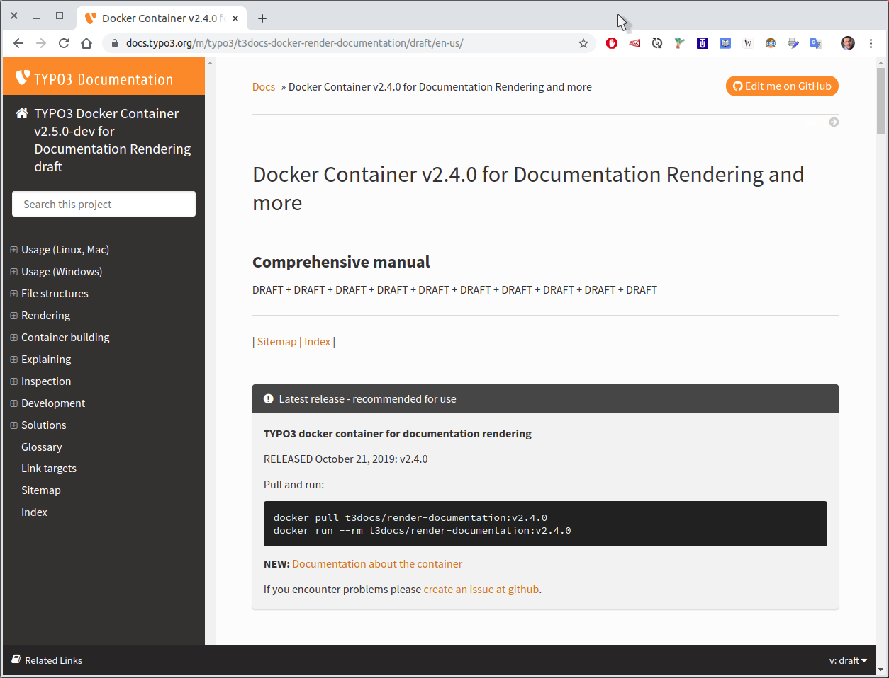
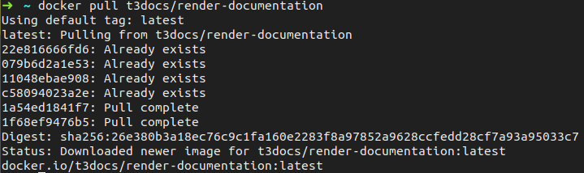
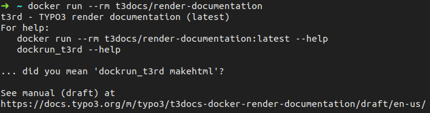

.. include:: /Includes.rst.txt

=======================
Get our Docker image
=======================

t3docs/render-documentation at GitHub
=====================================

*  https://github.com/t3docs/docker-render-documentation

.. figure:: files/052.png
   :target: https://github.com/t3docs/docker-render-documentation

.

.

.

.

.

.

.

.

.

.

.

.

.

.

.

.

You'll find pointers there
==========================

.

.

.

.

.

.

.

.

.

.

.

.

.

.

.

.

Documentation for the image
===========================

`TYPO3 Docker Container for Rendering Documentation
<https://docs.typo3.org/m/typo3/t3docs-docker-render-documentation/draft/en-us/>`__

.

.

.

.

.

.

.

.

.

.

.

.

.

.

.

.

docker pull
===========

We are using 'pull' to make sure we are getting updates.

Pull the image::

   docker pull t3docs/render-documentation

May look similar to this:

.

.

.

.

.

.

.

.

.

.

.

.

.

.

.

.

Docker run
==========

This is the - almost - simplest run command. We added the `--rm` option.
Otherwise each run command leaves a copy of the container on your disk. ::

   docker run --rm t3docs/render-documentation

.

.

You should see something like this:

.

.

.

.

.

.

.

.

.

.

.

.

.

.

